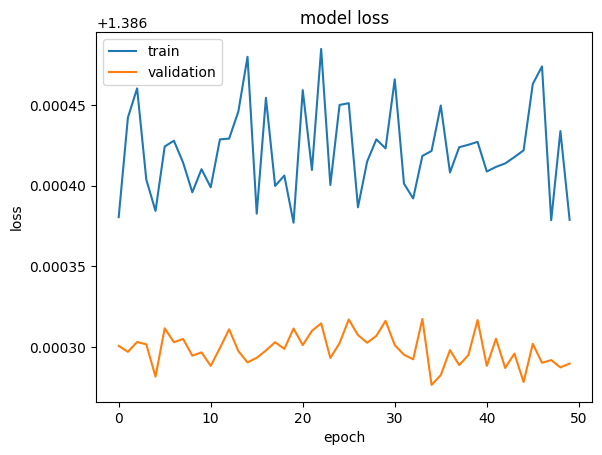

# Reporte del Modelo Baseline

Se realiza el siguiente entrenamiento de un modelo para la prediccion del tipo de enfermedad que tiene una planta de manzano de acuerdo a una imagen dada.

## Descripción del modelo

Este modelo base es creado para poder validar cual es el tipo de enfermedad para el arbol de manzano de acuerdo a una imagen entregada.

## Variables de entrada

Como tal se utiliza una sola variable que es la imagen de la planta de arbol de manzano.

## Variable objetivo

La variable objetivo es la de healthy que nos muestra si la imagen luego de analizada muestra si la planta esta sana o enferma

## Evaluación del modelo

Como se indicaba anteriormente se realizo el entrenamiento del modelo y su evaluacion de acuerdo a las capas usadas con el modelo base de MobileNet y adicionandole dos capas convulucionales
Model: "model"
_________________________________________________________________

### Métricas de evaluación

Como metricas de evaluacion tenemos la de perdida

y la de comparacion de perdida y accurancy

Estas metricas nos dan buenos resultados en el primer entrenamiento con solo 5 epocas utilizadas

### Resultados de evaluación

En los resultados de evaluacion se encuentra que si se aumentan las epocas de entrenamiento y no se utilizan las capas convoluucionales adicionadas el modelo presenta falla.

## Análisis de los resultados

El modelo base final utilizado tiene un accuracy de 0.224 lo cual lo acerca muchoo  a una buena prediccion.

## Conclusiones

Como conclusion es necesario tener una maquina potente para poder realizar el entrenamiento y reentrenamiento, ademas de que por tener mas epocas en el entrenameinto no siempre se obtienen mejores resultados.

