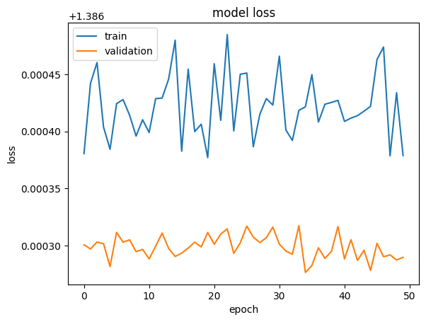

# Reporte del Modelo Final

## Resumen Ejecutivo

El presente modelo esta creado en la necesidad de tener una forma de poder realizar un analisis de imagenes de arboles de manzano con las cuales se pueda identificar si seeeee encuentran con enfermedad y poder identificar si esta entre tres tipos especiales

## Descripción del Problema

Uno de los usos principales de los modelos de machine learning es el poder utilizarlos para el area agricola en la cual se busca de una manera facil identificar enfermedades y sugerir tratamientos sobre estos, de acuerdo a diferentes factores. En especial con el uso de los dispositivos electronicos que pueden dar una opcion mas rapida al poder usar este tipo de modelos como prevencion.

## Descripción del Modelo

El modelo esta creado con dos redes convolucionales sobre el modelo base de MobileNet, ya que esta fue la combinacion que mas dio resultados al momento de hacer las pruebas.

## Evaluación del Modelo

En los resultados de evaluacion se encuentra que si se aumentan las epocas de entrenamiento y no se utilizan las capas convoluucionales adicionadas el modelo presenta falla.

## Conclusiones y Recomendaciones

Como conclusion es necesario tener una maquina potente para poder realizar el entrenamiento y reentrenamiento, ademas de que por tener mas epocas en el entrenameinto no siempre se obtienen mejores resultados.
